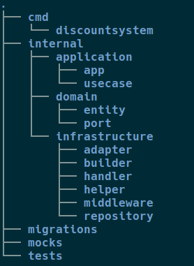

## Система скидок

Небольшой тренировочный проект с моим вариантом чистой архитектуры. 

- **application/app** - приложение, его конфигурация, флаги
- **application/usecase** - основная логика
- **domain/entity** - доменные сущности
- **domain/ports** - интерфейсы
- **infrastructure/adapter** - реализация интерфейсов
- **infrastructure/repository** - реализация репозиториев
- **infrastructure/builder** - "сборщик" приложения  
- **infrastructure/handler** - http.Handler-ы
- **infrastructure/middleware** - авторизация, логирование запросов
- **migrations** - миграции
- **mocks** - сгенерированные тестовые двойники  
- **tests** - интеграционные тесты (testcontainers + docker-compose) 